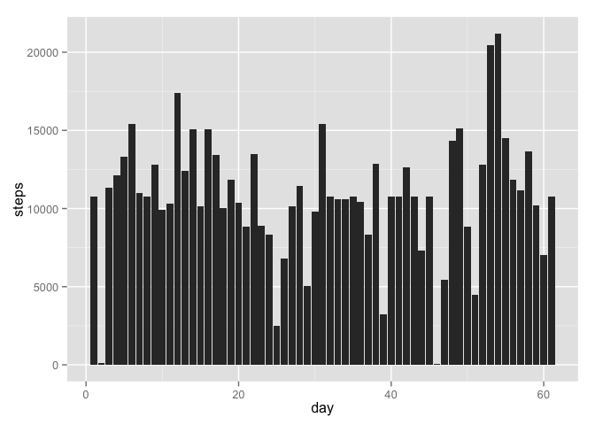

# Reproducible Research: Peer Assessment 1


## Introduction
This assignment makes use of data from a personal activity monitoring device. This device collects data at 5 minute intervals through out the day. The data consists of two months of data from an anonymous individual collected during the months of October and November, 2012 and include the number of steps taken in 5 minute intervals each day.

## Loading and preprocessing the data
First load the data and check the variable names

```r
data <- read.csv('activity.csv')
names(data)
```

```
## [1] "steps"    "date"     "interval"
```

## What is mean total number of steps taken per day?
Make a histogram of the total number of steps taken each day

```r
total_steps_day <- aggregate(steps ~ date, data = data, sum)
total_steps_day[,'day'] <- 1:nrow(total_steps_day)
#qplot(x=date, y=steps, data=total_steps_day, geom="histogram")
ggplot(total_steps_day, aes(day,steps)) + geom_histogram(stat='identity')
```

 

The correspondent date of each day

```
##    day       date
## 1    1 2012-10-02
## 2    2 2012-10-03
## 3    3 2012-10-04
## 4    4 2012-10-05
## 5    5 2012-10-06
## 6    6 2012-10-07
## 7    7 2012-10-09
## 8    8 2012-10-10
## 9    9 2012-10-11
## 10  10 2012-10-12
## 11  11 2012-10-13
## 12  12 2012-10-14
## 13  13 2012-10-15
## 14  14 2012-10-16
## 15  15 2012-10-17
## 16  16 2012-10-18
## 17  17 2012-10-19
## 18  18 2012-10-20
## 19  19 2012-10-21
## 20  20 2012-10-22
## 21  21 2012-10-23
## 22  22 2012-10-24
## 23  23 2012-10-25
## 24  24 2012-10-26
## 25  25 2012-10-27
## 26  26 2012-10-28
## 27  27 2012-10-29
## 28  28 2012-10-30
## 29  29 2012-10-31
## 30  30 2012-11-02
## 31  31 2012-11-03
## 32  32 2012-11-05
## 33  33 2012-11-06
## 34  34 2012-11-07
## 35  35 2012-11-08
## 36  36 2012-11-11
## 37  37 2012-11-12
## 38  38 2012-11-13
## 39  39 2012-11-15
## 40  40 2012-11-16
## 41  41 2012-11-17
## 42  42 2012-11-18
## 43  43 2012-11-19
## 44  44 2012-11-20
## 45  45 2012-11-21
## 46  46 2012-11-22
## 47  47 2012-11-23
## 48  48 2012-11-24
## 49  49 2012-11-25
## 50  50 2012-11-26
## 51  51 2012-11-27
## 52  52 2012-11-28
## 53  53 2012-11-29
```

Calculate and report the mean and median of the total number of steps taken per day

```r
mean <- mean(total_steps_day[,'steps'], na.rm = TRUE)
median <- median(total_steps_day[,'steps'], na.rm = TRUE)
print(paste ('median:', median, 'mean:', mean) )
```

```
## [1] "median: 10765 mean: 10766.1886792453"
```

## What is the average daily activity pattern?
Make a time series plot of the 5-minute interval (x-axis) and the average number of steps taken,
averaged across all days (y-axis)


```r
mean_steps_5interval <- aggregate(steps ~ interval, data = data, FUN = 'mean')
g <- ggplot(mean_steps_5interval, aes(interval, steps)) 
g + geom_line() + ylab('Steps mean') + xlab('5-minutes interval')
```

 

Which 5-minute interval, on average across all the days in the dataset, contains 
the maximum number of steps?

```r
max <- mean_steps_5interval[ which.max( mean_steps_5interval[,'steps'] ), ]
print(max)
```

```
##     interval    steps
## 104      835 206.1698
```

## Imputing missing values
Calculate and report the total number of missing values in the dataset (i.e. the total number of rows with NAs)

```r
sum(!complete.cases(data[,'steps']))
```

```
## [1] 2304
```

Create a new dataset that is equal to the original dataset but with the missing data filled in.
The missing value is replaced by the mean for that 5-minute interval.

```r
ndata <- read.csv('activity.csv')
for (i in which(!complete.cases(ndata[,'steps'])) ) {
    steps <- mean_steps_5interval[mean_steps_5interval$interval==ndata[i, 'interval']  ,'steps']
    ndata[i, 'steps'] <- steps
}
```

Make a histogram of the total number of steps taken each day and Calculate and report the mean and median total number of steps taken per day. 

```r
ntotal_steps_day <- aggregate(steps ~ date, data = ndata, sum)
ntotal_steps_day[,'day'] <- 1:nrow(ntotal_steps_day)
ggplot(ntotal_steps_day, aes(day,steps)) + geom_histogram(stat='identity')
```

 

Calculate and report the mean and median of the total number of steps taken per day

```r
nmean <- mean(ntotal_steps_day[,'steps'])
nmedian <- median(ntotal_steps_day[,'steps'])
print(paste ('median:', nmedian, 'mean:', nmean) )
```

```
## [1] "median: 10766.1886792453 mean: 10766.1886792453"
```

Do these values differ from the estimates from the first part of the assignment? 
What is the impact of imputing missing data on the estimates of the total daily number of steps?

* Only the median was diferent, old: 10765 new: 10766.19
* The impact was small imputing missing data 

## Are there differences in activity patterns between weekdays and weekends?
Create a new factor variable in the dataset with two levels – “weekday” and “weekend” indicating whether a given date is a weekday or weekend day.

```r
ndata$wday <- weekdays(as.Date(ndata$date))
ndata[ ,'type'] <- 'weekday'
ndata[ndata$wday=='Sunday','type'] <- 'weekend'
ndata[ndata$wday=='Saturday','type'] <- 'weekend'
```

Make a panel plot containing a time series plot of the 5-minute interval (x-axis) and the average number of steps taken, averaged across all weekday days or weekend days (y-axis).

```r
n5interval <- aggregate(steps ~ interval + type, data = ndata, FUN = 'mean')
g <- ggplot(n5interval, aes(interval, steps)) 
g + geom_line(facet=	~	type,) + ylab('Steps mean') + xlab('5-minutes interval') + facet_wrap(~type)
```

 

In the weekdays the total of steps is greater

